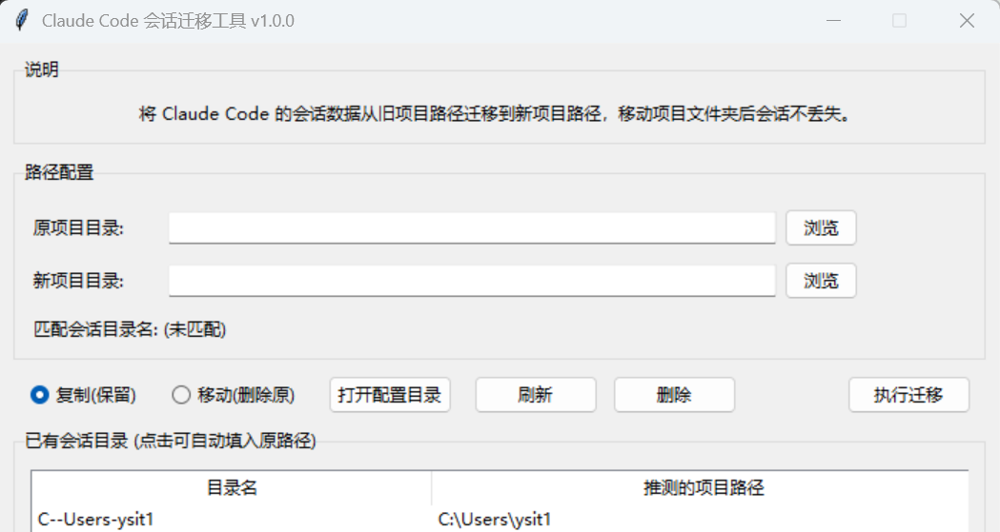

# Claude Code Session Migration Tool

[中文](README.md) | [English](README.en.md)

A lightweight desktop tool (Tkinter) for migrating Claude Code session folders after project paths change, so your previous sessions are not lost.

> Current version: `v1.0.0`

## Features

- Session migration: supports **copy** (keep original session) or **move** (remove original session)
- Auto matching: matches Claude session folder names based on the "old project path"
- Manual refresh: manually refresh matching results between current path and session folders
- Session deletion: delete matched session folders (with confirmation)
- Quick config access: one-click open Claude config directory (`~/.claude/projects`)
- Visualized list: show existing session folders and inferred project paths; click to fill old path

## Screenshot



## Use Cases

- You moved a project from `D:\old\repo` to `D:\new\repo`
- Claude Code can no longer find the old session because the path changed
- You want to map the old-path session to the new path and continue working

## How It Works (Brief)

The tool encodes project paths into Claude session folder naming format, then performs folder copy, move, or delete operations in `~/.claude/projects`.

Current encoding rules:

- Use `--` after Windows drive letter (for example, `d:/work/demo` -> `d--work-demo`)
- Map path separator `/` to `-`
- Treat `_` in original paths as `-`
- Matching is compatible with some legacy formats (for example, single `-` after drive letter)

## Requirements

- Python 3.8+
- Standard library only (no extra third-party packages required): `tkinter`, `pathlib`, `shutil`, etc.

## Quick Start

### 1) Run from source

```bash
python main.py
```

### 2) GUI workflow

1. Select or enter the "Old project path"
2. Select or enter the "New project path"
3. Choose mode: `Copy (Keep)` or `Move (Delete original)`
4. Click `Run Migration`

Additional actions:

- Click `Refresh`: re-match session folders for the current old project path
- Click `Delete`: remove the session folder matched by current old project path
- Click `Open Config Directory`: open `~/.claude/projects`

## Build EXE (Windows)

The project already includes `build.bat`:

```bat
build.bat
```

The script will automatically:

1. Check Python
2. Check and install PyInstaller (if missing)
3. Build a single-file windowed executable

Build artifact:

- `dist/cc-session-util.exe`

## Project Structure

```text
.
├── main.py                # Main program (Tkinter GUI + session migration logic)
├── build.bat              # One-click Windows build script
├── cc-session-util.spec   # PyInstaller spec file
└── build/                 # Intermediate build artifacts
```

## Notes

- Deleting session folders is irreversible, so confirm carefully before proceeding
- "Inferred project path" is for display only and may be imperfect due to encoding information loss
- If matching fails, try `Refresh` first, and verify that the old project path matches the historical path

## FAQ

### Q1: Why does the listed path look partially incorrect?

When session folder names are encoded, both `_` and path separators may map to `-`. This causes information loss during decoding, so displayed paths are "inferred values."

### Q2: What does "target session folder already exists" mean during migration?

It means a session folder for the new path already exists. You can choose to overwrite it, or manually back up the target folder before migration.

### Q3: How do I know which session folder is matched by the current old path?

Check the "Matched Session Folder Name" in the UI, or click `Refresh` and read the message prompt.

## License

If you plan to publish this project as open source, add a `LICENSE` file (for example, MIT).

